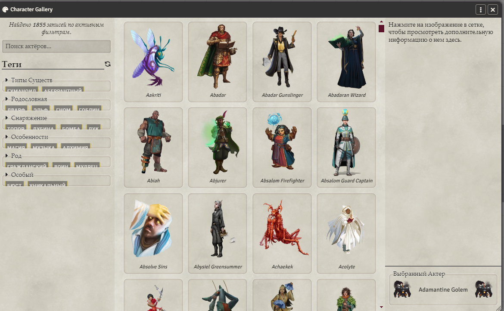

[](https://github.com/Metofay/pf2e-token-pack-character-gallery/releases/latest)

[](https://boosty.to/metofay)
[](https://github.com/Metofay/pf2e-token-pack-character-gallery/blob/master/README.md)

## 🐲 About the module

This additional module for **Foundry VTT** adds a Character Gallery to the **Pathfinder 2e** system, works with integration into the main module [**Pathfinder 2E: Token Pack**](https://github.com/Metofay/pf2e-token-pack).

## ⚙️ Module functionality

### 1. Character Gallery
Adds a new mechanic of a large, fully localized library of art "Character Gallery" for images that are not in the standard compendiums.



## 📥 Installation

1. In the Foundry VTT module settings menu, click **"Install Module"**.
2. In the "Manifest URL" field, paste the following link:
```
https://raw.githubusercontent.com/Metofay/pf2e-token-pack-character-gallery//main/module.json
```
3. Click **"Install"** and wait for the installation to complete.
4. Activate the module in your game world settings.

## 📚 Content Coverage

✅ - Ready

| Source | Status |
| :--- | :---: |
| Character Gallery | ✅ |
| Myth and Magic | ✅ |
| Bestiaries | ✅ |
| NPC Core | ✅ |
| AP Shades of Blood | ✅ |
| AP Abomination Vaults | ✅ |
| Beginner Box | ✅ |

## ❤️ Support the author

If you like my work, you can support me on Boosty. This really motivates me to further develop the module!